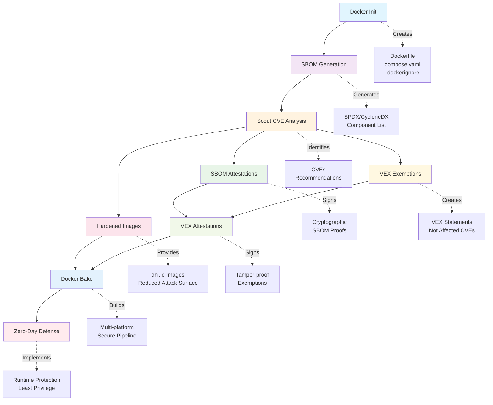

# Docker Commandos v1.5: Asgard Mission

This repository contains the source code and resources for the **10 Docker Commandos** workshop at Rabobank in March 2026. The workshop will cover the following topics:

- 0️⃣ [CVEs](#cves)
- 1️⃣ [Docker Init](#commando-1-docker-init)
- 2️⃣ [SBOM](#commando-2-sbom)
- 3️⃣ [Scout](#commando-3-scout)
- 4️⃣ [SBOM Attestations](#commando-4-sbom-attestations)
- 5️⃣ [Hardened Images](#commando-5-docker-hardened-images)
- 6️⃣ [Exempted CVEs](#commando-6-the-exempted-cves)
- 7️⃣ [VEX Attestations](#commando-7-vex-attestation)
- 8️⃣ [Docker Bake](#commando-8-docker-bake)
- 9️⃣ [Zero-Day Defense](#commando-9-the-zero-day)

**Key outcomes**: Automated vulnerability detection, reduced false positives, cryptographic supply chain verification, and defense-in-depth against unknown threats.

## Command Dependencies



## The Story: Attack on Asgard

CVEs have breached the walls of Asgard! Thor's hammer is useless against these shadow-based vulnerabilities. Odin summons the **Docker Commandos** to hunt down these hidden predators and secure the realm.


Meet your team:

- **Agent Null** 🎭 - The masked hunter
- **Wilhelmina (Mina)** 🧛‍♀️ - The undead assassin
- **Gord** ⚔️ - The swordmaster
- **Rothütle** 🎩 - The guy with a red hat
- **Captain Ahab** 🐋 - From the land of the whales
- **The Valkyrie** 🛡️ - The fierce warrior
- **Jack** 🤖 - The cyborg soldier
- **Evie** 🤠 - The cowgirl and sharpshooter

## Prerequisites

Before joining the hunt, make sure you have:

- Docker Desktop (latest version)
- Git
- A Bash shell (Git Bash on Windows, Terminal on macOS/Linux)
- A Docker Hub account
- Text editor of choice

## Setup

Clone the workshop repository:

```bash
git clone https://github.com/DockerSecurity-io/commandos-v1.5
cd commandos-v1.5
```

Let's begin the hunt! 🎯

## Commando 1. Docker Init

**Mission**: Docker Commandos arrive at Asgard and initiate their mission to contain the outbreak.

**Real-world context**: Docker Init creates secure, production-ready Dockerfiles using established best practices, reducing the likelihood of security misconfigurations from day one.

_Main article: [Dockerizing a Java 24 Project with Docker Init](https://dockerhour.com/dockerizing-a-java-24-project-with-docker-init-6f6465758c55)_  
_Main article: [JAVAPRO: How to Containerize a Java Application Securely](https://javapro.io/2025/07/03/how-to-containerize-a-java-application-securely/)_

_In case you want to skip Docker Init, you can use the `flask-init` directory, which contains the files created by Docker Init._

Docker Init is a command to initialize a Docker project with a Dockerfile and other necessary files:

- `Dockerfile`
- `compose.yaml`
- `.dockerignore`
- `README.Docker.md`

The command doesn't use GenAI, so is deterministic, and employs best practices for Dockerfile creation.

Docker Init is available on Docker Desktop 4.27 or later and is generally available.

### Usage

On the repo, go to the Flask example directory:

```bash
cd flask
```

Then, run the Docker Init command:

```bash
docker init
```

The command will ask you 4 questions, accept the defaults:

- ? What application platform does your project use? **Python**
- ? What version of Python do you want to use? **3.13.7**
- ? What port do you want your app to listen on? **8000**
- ? What is the command you use to run your app? **gunicorn 'hello:app' --bind=0.0.0.0:8000**

Then, start Docker Compose with build:

```bash
docker compose up --build
```

The application will be available at [http://localhost:8000](http://localhost:8000).

### Exercises

- 1.1. If you want a more tricky example, try Dockerizing a Java 24 application using Docker Init. You can follow the instructions in the [JAVAPRO article](https://javapro.io/2025/07/03/how-to-containerize-a-java-application-securely/) that I published in July 2025.
- 1.2. Compare the Dockerfile created for the Java application with the one created for the Python application. What are the differences?

---

## Commando 2. SBOM

**Mission**: Rothütle asks Thor for a list of all Asgard residents. Now the Commandos can cross-reference with the CVE database to identify which residents are CVEs.

**Real-world context**: SBOM (Software Bill of Materials) lists all components, libraries, and dependencies in your software. Essential for identifying vulnerabilities in your supply chain.

_Requirement: This step requires the [Docker Init](#commando-1-docker-init) step to be completed first._

Docker SBOM is integrated into Docker Desktop, but is also available for Docker CE as a CLI plugin that you need to install separately.

**Note**. _Docker engineers want to remove `docker sbom` in favor of `docker scout sbom`, but the command is still available. The `docker sbom` command is just a wrapper around the open-source [syft](https://github.com/anchore/syft) that can be used directly._

### Usage

In the Docker Init step, we built an image with tag `flask-server:latest`. Let's check the SBOM for this image:

```bash
docker sbom flask-server:latest
```

The output will show the SBOM in a table format. Try to export it to a SPDX file:

```bash
docker sbom --format spdx-json flask-server:latest > sbom.spdx.json
```

If you investigate the file, you will see that it contains a list of all the packages used in the image, their versions, and the licenses.

A more interesting example will be a C++ application.

Go to the C++ example directory:

```bash
cd cpp
```

Then, build the image:

```bash
docker build -t cpp-hello .
```

Now, check the SBOM for the image:

```bash
docker sbom cpp-hello
```

It will say there are no packages in the image, because the image is built from a `FROM scratch` base image. But, in the build stage, we installed many packages, and a vulnerability in those packages can affect the final image.

### Deep Dive: SBOM Standards and Regulatory Requirements

**Technical Standards**:

- **SPDX (Software Package Data Exchange)**: ISO/IEC 5962:2021 international standard
- **CycloneDX**: OWASP-maintained format optimized for security use cases

**Regulatory Landscape** - SBOM requirements are becoming mandatory:

- **Executive Order 14028 (2021)**: US federal agencies must provide SBOMs for software
- **EU Cyber Resilience Act**: Mandatory SBOMs for connected products by 2025
- **FDA Cybersecurity**: Medical device manufacturers must provide SBOMs

**Log4Shell Impact**: When Log4Shell (CVE-2021-44228) was discovered, organizations with comprehensive SBOMs could identify affected systems within hours instead of weeks.

### Exercises

- 2.1. Use `docker sbom --help` to check available formats for the SBOM output.
- 2.2. Compare different base images: `docker sbom node:18` vs `docker sbom node:18-alpine` - which has fewer packages?

---

## Commando 3. Scout

**Mission**: Gord orders Jack, Agent Null, and Mina to scout the remaining districts of Asgard for hidden CVEs. "Let's hunt some CVEs!" says Null.

**Real-world context**: Docker Scout analyzes your images for vulnerabilities by cross-referencing the SBOM with CVE databases, providing actionable security intelligence.

_Requirement: This step requires the [SBOM](#commando-2-sbom) step to be completed first._

Docker Scout is available on Docker Desktop, and as a CLI plugin for Docker CE.

### Usage

To check the vulnerabilities in the image, run:

```bash
docker scout cves flask-server:latest
```

You can also check the vulnerabilities using the Docker Desktop UI. Just go to the "Images" tab, select the image, and click on "Scout".

There are also recommendations for the image, which you can check by running:

```bash
docker scout recommendations flask-server
```

Try comparing base images for security:

```bash
# Standard Node image
docker scout cves node:20

# Alpine Node image
docker scout cves node:20-alpine

# Which is more secure?
```

### Deep Dive: CVE Intelligence and CVSS Scoring

**CVSS (Common Vulnerability Scoring System)** provides standardized severity ratings:
- **Critical (9.0-10.0)**: Remote code execution, privilege escalation
- **High (7.0-8.9)**: Significant impact but with some constraints
- **Medium (4.0-6.9)**: Moderate impact, often requires user interaction
- **Low (0.1-3.9)**: Minimal impact or high complexity exploitation

**Real-world Example - React2Shell (CVE-2025-55182)**[^1]: This critical vulnerability with CVSS score 10.0 affects React Server Components and allows unauthenticated remote code execution. It would appear in Scout as:

```bash
docker scout cves my-react-app
# CRITICAL   CVE-2025-55182  react  19.0.0
# Remote code execution via server-side rendering
# Recommendation: Upgrade to react@19.0.1 or later
```

**False Positive Management**: Not every CVE affects your specific use case - unused code paths, network isolation, and runtime mitigations can prevent exploitation.

### Exercises

- 3.1. Try to fix the vulnerabilities in the Flask image using the recommendations from Docker Scout.
- 3.2. Build an application with an old base image (e.g., `node:14`) and compare Scout results with newer versions.
- 3.3. Use the `--details` flag to get more information about specific vulnerabilities.

---

## Commando 4. SBOM Attestations

**Mission**: The Valkyrie sets up a camera with face recognition and says, "I can generate an ID card for everyone in Asgard, and attach it to their database face record. That way, we can verify their identity at the checkpoints."

**Real-world context**: SBOM attestations are SBOMs generated during build time and cryptographically signed, providing tamper-proof component information that travels with your image.

_Requirement: This step requires the [Scout](#commando-3-scout) step to be completed first._

_Main article: [DockerDocs: Supply-Chain Security for C++ Images](https://docs.docker.com/guides/cpp/security/)_

SBOM attestations are generated during the build and attached to the image.

### Usage

SBOM attestations are generated during the build:

```bash
docker buildx build --sbom=true -t cpp-hello:with-sbom .
```

Now, let's check the CVEs with Docker Scout:

```bash
docker scout cves cpp-hello:with-sbom
```

It will say:

```
SBOM obtained from attestation, 0 packages found
```

The SBOM has no packages, because we built the image from a `FROM scratch` base image. We can fix this by including the build stage packages in the SBOM.

Add the following line to the beginning of the `Dockerfile`:

```dockerfile
ARG BUILDKIT_SBOM_SCAN_STAGE=true
```

This line goes before the `FROM` line, and it tells Docker to include the build stage packages in the SBOM.

Now, rebuild the image:

```bash
docker buildx build --sbom=true -t cpp-hello:with-build-stage .
```

Now, check the SBOM attestations for the image again:

```bash
docker scout cves cpp-hello:with-build-stage
```

It will say:

```
SBOM of image already cached, 208 packages indexed
```

### Deep Dive: Cryptographic Attestations and Supply Chain Trust

**in-toto Attestation Framework**[^2]: SBOM attestations follow the in-toto specification, providing cryptographic proof of authenticity with predicate (SBOM data), subject (container image), and signature.

**OCI Referrers**: There are two types of SBOM attestations: BuildKit attestations are stored on the image, while Cosign attestations are stored in the registry as OCI referrers. This means the Cosign attestations are stored separately from the image, but refers to the image through the OCI referrer mechanism.

**Enterprise Compliance**: SLSA Level 3 requires signed attestations, FIPS 140-2 needs cryptographic verification, and SOC 2 Type II uses attestations as auditable supply chain evidence.

### Exercises

- 4.1. Create a Docker Bake file for the C++ example with SBOM attestations.
- 4.2. Generate SBOM locally instead of pushing: `docker buildx build --sbom=true --sbom-output=type=local,dest=. -t test-image .`
- 4.3. Compare SBOM results with and without `BUILDKIT_SBOM_SCAN_STAGE=true` for a multi-stage build.

---

## Commando 5. Docker Hardened Images

**Mission**: The Commandos reach the golden gates of a heavily fortified district. Thor says, "This district is heavily fortified, no CVE can get in here." The district is guarded by Hardened Warriors led by **Artemisia**, who says "I know how to recognize CVEs."

**Real-world context**: Docker Hardened Images (DHI) are near-zero-CVE base images maintained by Docker, providing a more secure foundation with dramatically reduced attack surface.

_Main article: [Docker Hardened Images are Free](https://www.dockersecurity.io/blog/docker-hardened-images-are-free)_

Docker Hardened Images were open-sourced in December 2025, and are freely available at [dhi.io](https://dhi.io).

### Usage

Build an application with hardened base:

```dockerfile
# Non-hardened Node image
FROM node:25

# Hardened Node image for development
FROM dhi.io/node:25-dev AS build

# Hardened Node image for production
FROM dhi.io/node:25
```

Compare standard vs hardened Node images:

```bash
# Standard Node image
docker scout cves node:25

# Hardened Node image
docker scout cves dhi.io/node:25
```

When fetching the DHI version, you will see the following output:

```
    ✓ SBOM obtained from attestation, 20 packages found
    ✓ Provenance obtained from attestation
    ✓ VEX statements obtained from attestation
    ✓ No vulnerable package detected
```

At the time of writing, the hardened Node image have 0 CVEs. The non-hardened Node image has 4 high CVEs, 6 medium, and 167 low CVEs.
The Docker Scout report mentioned VEX statements, which we will cover soon.

To check with Trivy:

```bash
trivy image --scanners vuln dhi.io/node:25
```

### Deep Dive: Attack Surface Reduction and Security Engineering

**Hardening Statistics** (as of December 2025)[^4]:

```
Standard node:20    vs    dhi.io/node:20
- 169 low CVEs             8 low CVEs
- 17 medium CVEs           0 medium CVEs
- 9 high CVEs              0 high CVEs
- 0 critical CVEs          0 critical CVEs
```

### Exercises

- 5.1. Audit your current base image usage and calculate CVE reduction potential with hardened images.
- 5.2. Build the same application with standard and hardened base images, compare Scout results.
- 5.3. Explore the available hardened image portfolio: [dhi.io](https://dhi.io) and identify which images are available for your tech stack.

---

## Commando 6. The Exempted CVEs

**Mission**: Mina returns from her patrol and tells Gord, "I found a few remaining CVEs, but they are not dangerous. We can let them be."

**Real-world context**: Not all CVEs are exploitable in your specific context. VEX (Vulnerability Exploitability eXchange) allows you to mark CVEs as not applicable to reduce alert noise and focus on real threats.

VEX is a standardized format for communicating the exploitability of vulnerabilities in software components.

### Usage

Find a CVE to exempt:

```bash
cd exercises/node-app
docker scout cves node-app | grep CVE
# Pick a CVE that's in a dependency you don't use
```

Install vexctl:

```bash
# macOS
brew install vexctl

# Linux
wget https://github.com/openvex/vex/releases/latest/download/vexctl-linux-amd64
chmod +x vexctl-linux-amd64
sudo mv vexctl-linux-amd64 /usr/local/bin/vexctl
```

Create a VEX statement:

```bash
vexctl create \
  --author="your-email@example.com" \
  --product="pkg:docker/example/node-app@v1" \
  --subcomponents="pkg:npm/vulnerable-package@1.0.0" \
  --vuln="CVE-2023-12345" \
  --status="not_affected" \
  --justification="vulnerable_code_not_in_execute_path" \
  --file="CVE-2023-12345.vex.json"
```

Apply VEX to Scout scan:

```bash
mkdir vex-statements
mv CVE-2023-12345.vex.json vex-statements/

docker scout cves node-app --vex-location ./vex-statements
```

The CVE should disappear from the Scout output.

### Deep Dive: VEX Standards and Context Analysis

**VEX Status Classifications**[^5]:

- **not_affected**: Component not present or vulnerable code not in execute path
- **affected**: Vulnerability impacts the product, action required
- **fixed**: Vulnerability resolved in specified version
- **under_investigation**: Impact being assessed

**Log4Shell Context Example**: Log4Shell (CVE-2021-44228) affected Log4j differently across applications:

- Apps logging user input: `status="affected"` - immediate upgrade required
- Apps logging only internal events: `status="not_affected"` with justification `vulnerable_code_cannot_be_controlled_by_adversary`
- Apps including Log4j but using different logging: `status="not_affected"` with justification `vulnerable_code_not_in_execute_path`

### Exercises

- 6.1. Identify a CVE in your application that's not exploitable and create a proper VEX statement.
- 6.2. Research VEX justification categories and determine which applies to your use case.

---

## Commando 7. VEX Attestation

**Mission**: The Valkyrie issues "Check Exemption" badges for the Exempted CVEs, and adds them to the checkpoints. "The Exempted CVEs can pass through the checkpoints without being flagged, as they are not a threat to us."

**Real-world context**: VEX attestations are cryptographically signed exemptions that travel with your image, providing tamper-proof vulnerability exception documentation that's verified automatically.

_Requirement: This step requires the [Exempted CVEs](#commando-6-the-exempted-cves) step to be completed first._

### Usage

Build image with SBOM and provenance:

```bash
docker buildx build \
  --sbom=true \
  --provenance=true \
  --push \
  -t [your-dockerhub-username]/vex-demo .
```

Create VEX statement:

```bash
vexctl create \
  --author="workshop@example.com" \
  --product="pkg:docker/[your-dockerhub-username]/vex-demo@latest" \
  --vuln="CVE-2023-12345" \
  --status="not_affected" \
  --justification="vulnerable_code_not_present" \
  --file="exemption.vex.json"
```

Add VEX attestation to image:

```bash
docker scout attestation add \
  --file exemption.vex.json \
  --predicate-type https://openvex.dev/ns/v0.2.0 \
  [your-dockerhub-username]/vex-demo
```

Alternatively, include VEX in build:

```dockerfile
# In your Dockerfile
COPY exemption.vex.json /vex/
```

Verify VEX attestation is applied:

```bash
docker scout cves [your-dockerhub-username]/vex-demo
# The exempted CVE should not appear
```

### Deep Dive: VEX Attestations and OCI Referrers

**OCI** (standing for **Open Container Initiative**) is a set of standards for container formats and runtimes. OCI Referrers allow you to attach metadata (like VEX statements) to container images in a standardized way. Adding VEX attestations to the image (copying them inside the image) is not the recommended way anymore, as it doesn't follow the OCI.

All the DHI images have the following attestations as OCI referrers:

- SBOM attestations and their signatures
- VEX attestations and their signatures
- Provenance attestations

VEX attestations for DHI images reduce the noise for CVEs that are not a threat, allowing security teams to focus on real vulnerabilities.

To check the OCI referrers for an image, one can use the `oras` CLI tool:

```bash
oras pull --include-subject dhi.io/node:20 
oras discover dhi.io/node:20
```

The output is something like this:

```
dhi.io/node@sha256:994ecfaa2453eab7077ceb7c886f0ef6bee411a2138e3619cd3a3bb3b1ae866c
└── application/vnd.dev.cosign.artifact.sig.v1+json
    └── sha256:e8f499ac859628ec6b2b446abf390d4ffd117ef0839a3e57d080f94745f3ebf4
```

The tree shows that the image has an attestation of type `application/vnd.dev.cosign.artifact.sig.v1+json`, which is a Cosign signature. The attestation is signed with the key that has the digest `sha256:e8f499ac859628ec6b2b446abf390d4ffd117ef0839a3e57d080f94745f3ebf4`.

### Exercises

- 7.1. Implement automated VEX generation based on static code analysis.
- 7.2. Integrate VEX attestations into your CI/CD pipeline.
- 7.3. Create audit reports showing VEX decision rationale for compliance.

---

## Commando 8. Docker Bake

**Mission**: As the Commandos defeated the CVEs in Asgard, they decided to throw a party to celebrate their victory, and discuss the security measures they can implement systematically.

**Real-world context**: Docker Bake allows you to define complex build configurations in files, making security practices repeatable, reviewable, and automated across your entire organization.

_Requirement: This step builds on all previous commandos._

_CLI reference: [docker buildx bake](https://docs.docker.com/reference/cli/docker/buildx/bake/)_

Docker Bake is to Docker Build what Docker Compose is to Docker Run. It allows you to build multiple images at once, using a single command.

### Usage

Create a comprehensive docker-bake.hcl:

```hcl
variable "REGISTRY" {
  default = "your-dockerhub-username"
}

group "default" {
  targets = ["app-dev", "app-prod"]
}

target "app-dev" {
  context = "."
  dockerfile = "Dockerfile"
  tags = ["${REGISTRY}/secure-app:dev"]
  target = "development"
  attest = [
    "type=provenance,mode=max",
    "type=sbom",
  ]
  platforms = ["linux/amd64"]
}

target "app-prod" {
  context = "."
  dockerfile = "Dockerfile"
  tags = [
    "${REGISTRY}/secure-app:latest",
    "${REGISTRY}/secure-app:v1.0"
  ]
  target = "production"
  attest = [
    "type=provenance,mode=max",
    "type=sbom",
  ]
  platforms = [
    "linux/amd64",
    "linux/arm64"
  ]
}
```

Create multi-stage Dockerfile with security practices:

```dockerfile
ARG BUILDKIT_SBOM_SCAN_STAGE=true
FROM dhi.io/node:20-dev AS development

WORKDIR /app
COPY package*.json ./
RUN npm ci
COPY . .
EXPOSE 3000
CMD ["npm", "run", "dev"]

FROM dhi.io/node:20 AS production
WORKDIR /app
COPY package*.json ./
RUN npm ci --only=production
COPY . .
USER node
EXPOSE 3000
CMD ["node", "server.js"]
```

Build with Bake:

```bash
# Build all targets
docker buildx bake --push

# Build specific target
docker buildx bake app-prod --push
```

Verify security attestations:

```bash
docker scout cves [your-dockerhub-username]/secure-app:latest
```

### Deep Dive: Infrastructure as Code for Container Security

**Bake vs Traditional Scripts**:
Traditional approach is error-prone with manual `docker build`, `docker tag`, `docker push` commands missing SBOM, provenance, and security scanning.

Docker Bake provides declarative, repeatable builds with comprehensive security by default - attestations, multi-platform builds, and integrated caching.

**SLSA Level 3 Compliance**: Docker Bake enables hermetic builds, reproducible builds, build provenance, and immutable build configurations in version control.

### Exercises

- 8.1. Create Bake configuration with SBOM, provenance, and VEX attestations for multiple environments.
- 8.2. Add multi-platform builds (linux/amd64, linux/arm64) and security gates.
- 8.3. Implement centralized security templates that teams can inherit.

---

## Commando 9. The Zero-Day

**Mission**: Agent Null reveals his true identity - he was with the Commandos from the beginning, but no one knew he was actually a zero-day vulnerability. He throws a smoke bomb and disappears, planning to free Angra Mainyu from the Black Forest.

**Real-world context**: Zero-day vulnerabilities are the most dangerous threats - unknown to security systems with no CVE ID yet. Defense requires proactive security measures that protect against unknown attack vectors.

Agent Null is a master of disguise and deception, a metaphor for zero-day vulnerabilities that are not yet known to the public and therefore have no CVE ID.

### Usage

Implement least privilege with capability dropping:

```bash
# Run container with all capabilities dropped
docker run --cap-drop=ALL \
           --read-only \
           --user 1000:1000 \
           --tmpfs /tmp \
           [your-app-image]
```

Create security-hardened Compose configuration:

```yaml
# compose.security.yaml
services:
  app:
    image: your-app:latest
    user: "1000:1000"
    read_only: true
    cap_drop:
      - ALL
    cap_add:
      - NET_BIND_SERVICE  # Only if needed for port 80/443
    security_opt:
      - no-new-privileges:true
    tmpfs:
      - /tmp
      - /var/cache
    volumes:
      - ./app-data:/app/data:ro
```

Test runtime protection:

```bash
# Create a container that tries to escape
docker run --rm -it \
           --cap-drop=ALL \
           --read-only \
           --user 1000:1000 \
           alpine sh

# Inside container, try these (they should fail):
# mount /dev/sda1 /mnt
# touch /etc/passwd
# su root
```

### Deep Dive: Defense-in-Depth and Zero-Day Mitigation

**Historical Zero-Day Examples**:

- **Heartbleed (2014)**[^6]: Vulnerable code existed for 3 years undetected, affected 66% of internet servers
- **Log4Shell (2021)**[^7]: Exploited within hours of disclosure, likely active for months as zero-day
- **React2Shell (2025)**[^1]: Server-side rendering RCE affecting React Server Components, actively exploited within hours of disclosure

**Defense Layers**:

1. **Container Isolation**: `FROM scratch`, nobody user (65534:65534)
2. **Linux Security**: AppArmor profiles, capability restrictions
3. **System Call Filtering**: Seccomp profiles allowing only necessary syscalls
4. **Runtime Monitoring**: Tools like Falco[^8] applying rules to detect anomalous behavior.

### Exercises

- 9.1. Design a zero-day defense strategy with layered security controls.
- 9.2. Implement runtime monitoring with Falco or behavioral analysis.
- 9.3. Create incident response procedures for unknown threat detection.
- 9.4. Test defenses against container escape techniques.

---

## Final Mission: Complete Security Pipeline

The hunt is complete, but Agent Null has escaped to the Black Forest. The Commandos have successfully defended Asgard using systematic security practices.

### Victory Conditions

✅ All builds generate SBOM and provenance attestations
✅ Hardened base images reduce attack surface
✅ VEX statements eliminate false positive noise
✅ Automated scanning prevents vulnerable deployments
✅ Zero-day defenses protect against unknown threats

### Enterprise Readiness Checklist

**Policy**: Container security policy, SBOM requirements, VEX approval process
**Technical**: Attestations, hardened images, automated scanning, VEX integration
**Operations**: Security gates, runtime monitoring, regular reviews
**Compliance**: Auditable evidence, regulatory alignment, documentation

The Docker Commandos have secured Asgard, but Agent Null's escape means the adventure continues in the Black Forest...

**Continue your security journey**:
- 📚 Read "Docker and Kubernetes Security"
- 🔍 Follow @DockerSecurity for threat intelligence
- 🎯 Join the Docker Security community
- 🚀 Implement these practices in production

*"The greatest victory is the attack that never happens because it cannot succeed."* - The Docker Commandos Creed

---

## References

[^1]: React Team. "Critical Security Vulnerability in React Server Components." React Blog, December 3, 2025. [https://react.dev/blog/2025/12/03/critical-security-vulnerability-in-react-server-components](https://react.dev/blog/2025/12/03/critical-security-vulnerability-in-react-server-components) ; Wiz. "React2Shell (CVE-2025-55182): Critical React Vulnerability." Wiz Blog, 2025. [https://www.wiz.io/blog/critical-vulnerability-in-react-cve-2025-55182](https://www.wiz.io/blog/critical-vulnerability-in-react-cve-2025-55182)

[^2]: in-toto. "The in-toto Specification." [https://in-toto.io/](https://www.google.com/search?q=https://in-toto.io/)

[^3]: CISA. "Malware Discovered in Popular npm Package ua-parser-js." October 2021. [https://www.cisa.gov/news-events/alerts/2021/10/22/malware-discovered-popular-npm-package-ua-parser-js](https://www.google.com/search?q=https://www.cisa.gov/news-events/alerts/2021/10/22/malware-discovered-popular-npm-package-ua-parser-js)

[^4]: Mohammad-Ali A'râbi. "Docker Hardened Images are Free." Docker Security Blog, December 2025. [https://www.dockersecurity.io/blog/docker-hardened-images-are-free](https://www.dockersecurity.io/blog/docker-hardened-images-are-free)

[^5]: CISA. "Vulnerability Exploitability eXchange (VEX) - Status Justifications." Cybersecurity and Infrastructure Security Agency, 2024. [https://www.cisa.gov/sites/default/files/2024-01/VEX_Status_Justification_Jun22.pdf](https://www.cisa.gov/sites/default/files/2024-01/VEX_Status_Justification_Jun22.pdf)

[^6]: Durumeric, Z., et al. "The Matter of Heartbleed." Proceedings of the 2014 Conference on Internet Measurement Conference, 2014. [https://doi.org/10.1145/2663716.2663755](https://doi.org/10.1145/2663716.2663755)

[^7]: CISA. "Apache Log4j Vulnerability Guidance." Cybersecurity Alert AA21-356A, December 2021. [https://www.cisa.gov/news-events/cybersecurity-advisories/aa21-356a](https://www.cisa.gov/news-events/cybersecurity-advisories/aa21-356a)

[^8]: The Falco Project. "Cloud Native Runtime Security." [https://falco.org/](https://www.google.com/search?q=https://falco.org/)