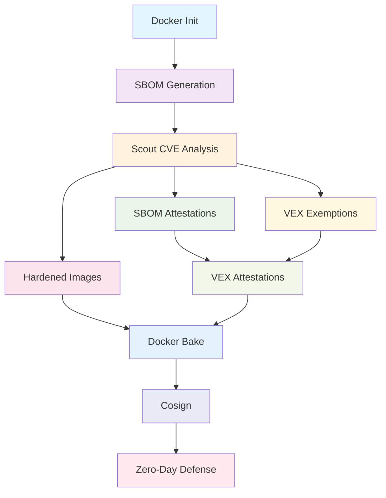

# Docker Commandos v1.5: Asgard Mission

This repository contains the source code and resources for the **10 Docker Commandos** workshop at Rabobank in March 2026. The workshop will cover the following topics:

- 1️⃣ [Docker Init](#commando-1-docker-init)
- 2️⃣ [SBOM](#commando-2-sbom)
- 3️⃣ [Scout](#commando-3-scout)
- 4️⃣ [SBOM Attestations](#commando-4-sbom-attestations)
- 5️⃣ [Hardened Images](#commando-5-docker-hardened-images)
- 6️⃣ [Exempted CVEs](#commando-6-the-exempted-cves)
- 7️⃣ [VEX Attestations](#commando-7-vex-attestation)
- 8️⃣ [Docker Bake](#commando-8-docker-bake)
- 9️⃣ [Cosign](#commando-9-cosign)
- 0️⃣ [Zero-Day Defense](#commando-0-the-zero-day)

**Key outcomes**: Automated vulnerability detection, reduced false positives, cryptographic supply chain verification, and defense-in-depth against unknown threats.

**Download PDF**: Docker Commandos Field Manual @ [buy.DockerSecurity.io](https://buy.dockersecurity.io/)

## Command Dependencies



## Docker Commandos


Meet your team:

- **Agent Null** 🎭 - The masked hunter
- **Wilhelmina (Mina)** 🧛‍♀️ - The undead assassin
- **Gord** ⚔️ - The swordmaster
- **Rothütle** 🎩 - The guy with a red hat
- **Captain Ahab** 🐋 - From the land of the whales
- **The Valkyrie** 🛡️ - The fierce warrior
- **Jack** 🤖 - The cyborg soldier
- **Evie** 🤠 - The cowgirl and sharpshooter

## Prerequisites

Before starting the journey, check [installation instructions](installation.md) to setup Docker Desktop, CLI tools, and pull the necessary images.

## Setup

Clone the workshop repository:

```bash
git clone https://github.com/DockerSecurity-io/commandos-v1.5
cd commandos-v1.5
```

## Prologue: The Attack on Asgard

Thor enters Odin's chamber hastily, "Father, Asgard is under attack! Shadow monsters called CVEs are in Asgard and my hammer Mjolnir can't destroy them!" Odin looks at him calmly, "**Summon the Docker Commandos**!"


## Commando 1. Docker Init

**Mission**: Docker Commandos arrive at Asgard and initiate their mission to contain the outbreak. Gord orders, "Set up a command center for us". Valkyrie and Agent Null start setting up the command center, while Jack and Evie secure the perimeter.

**Real-world context**: Docker Init creates secure, production-ready Dockerfiles using established best practices, reducing the likelihood of security misconfigurations from day one.

---

_Main article: [Dockerizing a Java 24 Project with Docker Init](https://dockerhour.com/dockerizing-a-java-24-project-with-docker-init-6f6465758c55)_  
_Main article: [JAVAPRO: How to Containerize a Java Application Securely](https://javapro.io/2025/07/03/how-to-containerize-a-java-application-securely/)_

_In case you want to skip Docker Init, you can use the `flask-init` directory, which contains the files created by Docker Init._

Docker Init is a command to initialize a Docker project with a Dockerfile and other necessary files:

- `Dockerfile`
- `compose.yaml`
- `.dockerignore`
- `README.Docker.md`

The command doesn't use GenAI, so is deterministic, and employs best practices for Dockerfile creation.

Docker Init is available on Docker Desktop 4.27 or later and is generally available.

### Usage

On the repo, go to the Flask example directory:

```bash
cd flask
```

Then, run the Docker Init command:

```bash
docker init
```

The command will ask you 4 questions, accept the defaults except for the Python version, that you should set to 3.14.3:

- ? What application platform does your project use? **Python**
- ? What version of Python do you want to use? **3.14.3**
- ? What port do you want your app to listen on? **8000**
- ? What is the command you use to run your app? **gunicorn 'hello:app' --bind=0.0.0.0:8000**

Then, start Docker Compose with build:

```bash
docker compose up --build
```

The application will be available at [http://localhost:8000](http://localhost:8000).

### Exercises

- 1.1. If you want a more tricky example, try Dockerizing a Java 24 application using Docker Init. You can follow the instructions in the [JAVAPRO article](https://javapro.io/2025/07/03/how-to-containerize-a-java-application-securely/) that I published in July 2025.
- 1.2. Compare the Dockerfile created for the Java application with the one created for the Python application. What are the differences?

---

## Commando 2. SBOM

**Mission**: Rothütle asks Thor for a list of all Asgard residents. Now the Commandos can cross-reference with the CVE database to identify which residents are CVEs.


**Real-world context**: SBOM (Software Bill of Materials) lists all components, libraries, and dependencies in your software. Essential for identifying vulnerabilities in your supply chain.

---

_Requirement: This step requires the [Docker Init](#commando-1-docker-init) step to be completed first. Otherwise, use the directory `flask-init`._

Docker SBOM is integrated into Docker Desktop, but is also available for Docker CE as a CLI plugin that you need to install separately.

**Note**. _Docker engineers want to remove `docker sbom` in favor of `docker scout sbom`, but the command is still available. The `docker sbom` command is just a wrapper around the open-source [syft](https://github.com/anchore/syft) that can be used directly._

### Usage

In the Docker Init step, we built an image with tag `flask-server:latest`. Let's check the SBOM for this image:

```bash
docker sbom flask-server:latest
```

The output will show the SBOM in a table format. Try to export it to a SPDX file:

```bash
docker sbom --format spdx-json flask-server:latest > sbom.spdx.json
```

If you investigate the file, you will see that it contains a list of all the packages used in the image, their versions, and the licenses.

A more interesting example will be a C++ application.

Go to the C++ example directory:

```bash
cd cpp
```

Then, build the image:

```bash
docker build -t cpp-hello .
```

Now, check the SBOM for the image:

```bash
docker sbom cpp-hello
```

It will say there are no packages in the image, because the image is built from a `FROM scratch` base image. But, in the build stage, we installed many packages, and a vulnerability in those packages can affect the final image.

### Deep Dive: SBOM Standards and Regulatory Requirements

**Technical Standards**:

- **SPDX (Software Package Data Exchange)**: ISO/IEC 5962:2021 international standard
- **CycloneDX**: OWASP-maintained format optimized for security use cases

**Regulatory Landscape** - SBOM requirements are becoming mandatory:

- **Executive Order 14028 (2021)**: US federal agencies must provide SBOMs for software
- **EU Cyber Resilience Act**: Mandatory SBOMs for connected products by 2025
- **FDA Cybersecurity**: Medical device manufacturers must provide SBOMs

**Log4Shell Impact**: When Log4Shell (CVE-2021-44228) was discovered, organizations with comprehensive SBOMs could identify affected systems within hours instead of weeks.

### Exercises

- 2.1. Use `docker sbom --help` to check available formats for the SBOM output.
- 2.2. Compare different base images: `docker sbom node:22` vs `docker sbom node:22-alpine` - which has fewer packages?

---

## Commando 3. Scout

**Mission**: Gord orders Jack, Agent Null, and Mina to scout the remaining districts of Asgard for hidden CVEs. "Let's hunt some CVEs!" says Null.


**Real-world context**: Docker Scout analyzes your images for vulnerabilities by cross-referencing the SBOM with CVE databases, providing actionable security intelligence.

---

_Requirement: This step requires the [SBOM](#commando-2-sbom) step to be completed first._

Docker Scout is available on Docker Desktop, and as a CLI plugin for Docker CE.

### Usage

To check the vulnerabilities in the image, run:

```bash
docker scout cves flask-server:latest
```

You can also check the vulnerabilities using the Docker Desktop UI. Just go to the "Images" tab, select the image, and click on "Scout".

Try comparing base images for security:

```bash
# Standard Node image
docker scout cves node:20

# Alpine Node image
docker scout cves node:20-alpine

# Which is more secure?
```

### Deep Dive: CVE Intelligence and CVSS Scoring

**CVSS (Common Vulnerability Scoring System)** provides standardized severity ratings:
- **Critical (9.0-10.0)**: Remote code execution, privilege escalation
- **High (7.0-8.9)**: Significant impact but with some constraints
- **Medium (4.0-6.9)**: Moderate impact, often requires user interaction
- **Low (0.1-3.9)**: Minimal impact or high complexity exploitation

**Real-world Example - React2Shell (CVE-2025-55182)**[^1]: This critical vulnerability with CVSS score 10.0 affects React Server Components and allows unauthenticated remote code execution. It would appear in Scout as:

```bash
docker scout cves my-react-app
# CRITICAL   CVE-2025-55182  react  19.0.0
# Remote code execution via server-side rendering
# Recommendation: Upgrade to react@19.0.1 or later
```

### Exercises

- 3.1. Build an application with an old base image (e.g., `node:14`) and compare Scout results with newer versions.
- 3.2. Use the `--details` flag to get more information about specific vulnerabilities.

---

## Commando 4. SBOM Attestations

**Mission**: The Valkyrie sets up a camera with face recognition and says, "I can generate an ID card for everyone in Asgard, and attach it to their database face record. That way, we can verify their identity at the checkpoints."


**Real-world context**: SBOM attestations are SBOMs generated during build time and cryptographically signed, providing tamper-proof component information that travels with your image.

---

_Requirement: This step requires the [Scout](#commando-3-scout) step to be completed first._

_Main article: [DockerDocs: Supply-Chain Security for C++ Images](https://docs.docker.com/guides/cpp/security/)_

SBOM attestations are generated during the build and attached to the image.

### Usage

SBOM attestations are generated during the build:

```bash
docker buildx build --sbom=true -t cpp-hello:with-sbom .
```

Now, let's check the CVEs with Docker Scout:

```bash
docker scout cves cpp-hello:with-sbom
```

It will say:

```
SBOM obtained from attestation, 0 packages found
```

The SBOM has no packages, because we built the image from a `FROM scratch` base image. We can fix this by including the build stage packages in the SBOM.

Add the following line to the beginning of the `Dockerfile`:

```dockerfile
ARG BUILDKIT_SBOM_SCAN_STAGE=true
```

This line goes before the `FROM` line, and it tells Docker to include the build stage packages in the SBOM.

Now, rebuild the image:

```bash
docker buildx build --sbom=true -t cpp-hello:with-build-stage .
```

Now, check the SBOM attestations for the image again:

```bash
docker scout cves cpp-hello:with-build-stage
```

It will say:

```
SBOM of image already cached, 208 packages indexed
```

### Deep Dive: Cryptographic Attestations and Supply Chain Trust

**in-toto Attestation Framework**[^2]: SBOM attestations follow the in-toto specification, providing cryptographic proof of authenticity with predicate (SBOM data), subject (container image), and signature.

**OCI Referrers**: There are two types of SBOM attestations: BuildKit attestations are stored on the image, while Cosign attestations are stored in the registry as OCI referrers. This means the Cosign attestations are stored separately from the image, but refers to the image through the OCI referrer mechanism.

**Enterprise Compliance**: SLSA Level 3 requires signed attestations, FIPS 140-2 needs cryptographic verification, and SOC 2 Type II uses attestations as auditable supply chain evidence.

**FIPS** or **Federal Information Processing Standards** are a set of standards for cryptographic modules used by the US government. FIPS 140-2 is a specific standard that defines security requirements for cryptographic modules. SBOM attestations that are FIPS-compliant can be used in environments that require FIPS validation.

### Exercises

- 4.1. Store the SBOM locally: `docker buildx build --sbom=true --sbom-output=type=local,dest=. -t test-image .`
- 4.2. Compare SBOM results with and without `BUILDKIT_SBOM_SCAN_STAGE=true` for a multi-stage build.

---

## Commando 5. Docker Hardened Images

**Mission**: The Commandos reach the golden gates of a heavily fortified district. Thor says, "This district is heavily fortified, no CVE can get in here." The district is guarded by Hardened Warriors led by **Artemisia**, who says "I know how to recognize CVEs, I will join you."


**Real-world context**: Docker Hardened Images (DHI) are near-zero-CVE base images maintained by Docker, providing a more secure foundation with dramatically reduced attack surface.

---

_Main article: [Docker Hardened Images are Free](https://www.dockersecurity.io/blog/docker-hardened-images-are-free)_

Docker Hardened Images were open-sourced in December 2025, and are freely available at [dhi.io](https://dhi.io).

### Usage

Build an application with hardened base:

```dockerfile
# Non-hardened Node image
FROM node:25

# Hardened Node image for development
FROM dhi.io/node:25-dev AS build

# Hardened Node image for production
FROM dhi.io/node:25
```

Compare standard vs hardened Node images:

```bash
# Standard Node image
docker scout cves node:25

# Hardened Node image
docker scout cves dhi.io/node:25
```

When fetching the DHI version, you will see the following output:

```
    ✓ SBOM obtained from attestation, 20 packages found
    ✓ Provenance obtained from attestation
    ✓ VEX statements obtained from attestation
    ✓ No vulnerable package detected
```

At the time of writing, the hardened Node image have 0 CVEs. The non-hardened Node image has 4 high CVEs, 6 medium, and 167 low CVEs.
The Docker Scout report mentioned VEX statements, which we will cover soon.

To check with Trivy:

```bash
trivy image --scanners vuln dhi.io/node:25
```

Trivy lists more CVEs, that's because a few CVEs are silenced by the VEX statement that Docker Scout is aware of, but Trivy is not. One can manually download the VEX statement and pass it to Trivy when scanning.

In the Flask example, we used slim images. Replace it with a hardened Python image:

```dockerfile
# Not hardened image
FROM python:${PYTHON_VERSION}-slim as base

# Hardened image
FROM dhi.io/python:${PYTHON_VERSION}-alpine3.23-fips-dev as base
```

The hardened image has 0 CVEs at the time of writing and is FIPS-compliant. Please note that we had to choose an Alpine-based hardened image, because the original slim image was Alpine-based. If we had used a Debian-based image, we needed to change the Alpine commands like `adduser` to Debian equivalents.

Run the application once more to verify it works with the hardened image:

```bash
docker compose up --build
```

### Exercises

- 5.1. Audit your current base image usage and calculate CVE reduction potential with hardened images.
- 5.2. Build the same application with standard and hardened base images, compare Scout results.
- 5.3. Explore the available hardened image portfolio: [dhi.io](https://dhi.io) and identify which images are available for your tech stack.

---

## Commando 6. The Exempted CVEs

**Mission**: Mina returns from her patrol and tells Gord, "I found a few remaining CVEs, but they are not dangerous. We can let them be."


**Real-world context**: Not all CVEs are exploitable in your specific context. VEX (Vulnerability Exploitability eXchange) allows you to mark CVEs as not applicable to reduce alert noise and focus on real threats.

---

VEX is a standardized format for communicating the exploitability of vulnerabilities in software components.

### Usage

Check the latest Flask image for CVEs:

```bash
docker scout cves flask-hello:latest
```

At the time of writing, if you use DHI base image, you will have one medium CVE and a bunch of low CVEs:

```
   0C     0H     1M     1L  tar 1.35+dfsg-3.1
pkg:deb/debian/tar@1.35%2Bdfsg-3.1?os_distro=trixie&os_name=debian&os_version=13

    ✗ MEDIUM CVE-2025-45582
      https://scout.docker.com/v/CVE-2025-45582
      Affected range : >=1.35+dfsg-3.1  
      Fixed version  : not fixed        
    
    ✗ LOW CVE-2005-2541
      https://scout.docker.com/v/CVE-2005-2541
      Affected range : <=1.35+dfsg-3.1  
      Fixed version  : not fixed 
```

Create a VEX statement:

```bash
vexctl create \
  --author="your-email@example.com" \
  --product="pkg:docker/flask-hello@latest" \
  --subcomponents="pkg:deb/debian/tar@1.35+dfsg-3.1" \
  --vuln="CVE-2025-45582" \
  --status="not_affected" \
  --justification="vulnerable_code_not_in_execute_path" \
  --file="CVE-2025-45582.vex.json"
```

Apply the VEX statement to Scout scan:

```bash
mkdir vex-statements
mv CVE-2025-45582.vex.json vex-statements/

docker scout cves flask-hello --vex-location ./vex-statements
```

The CVE is now marked as not affected:

```
pkg:deb/debian/tar@1.35%2Bdfsg-3.1?os_distro=trixie&os_name=debian&os_version=13

    ✗ MEDIUM CVE-2025-45582
      https://scout.docker.com/v/CVE-2025-45582
      Affected range : >=1.35+dfsg-3.1                                     
      Fixed version  : not fixed                                           
      VEX            : not affected [vulnerable code not in execute path]  
                     : your-email@example.com                              
```

### Deep Dive: VEX Standards and Context Analysis

**VEX Status Classifications**[^5]:

- **not_affected**: Component not present or vulnerable code not in execute path
- **affected**: Vulnerability impacts the product, action required
- **fixed**: Vulnerability resolved in specified version
- **under_investigation**: Impact being assessed

### Exercises

- 6.1. Identify a CVE in your application that's not exploitable and create a proper VEX statement.
- 6.2. Research VEX justification categories and determine which applies to your use case.

---

## Commando 7. VEX Attestation

**Mission**: The Valkyrie issues "Check Exemption" badges for the Exempted CVEs, and adds them to the checkpoints. "The Exempted CVEs can pass through the checkpoints without being flagged, as they are not a threat to us."


**Real-world context**: VEX attestations are cryptographically signed exemptions that travel with your image, providing tamper-proof vulnerability exception documentation that's verified automatically.

---

_Requirement: This step requires the [SBOM Attestations](#commando-4-sbom-attestations) and [Exempted CVEs](#commando-6-the-exempted-cves) step to be completed first._

### Usage

Let's build the Flask example with SBOM attestations enabled and push to Docker Hub:

```bash
docker buildx build \
  --sbom=true \
  --provenance=true \
  --push \
  -t aerabi/flask-hello:with-sbom .
```

You need to use your own Docker Hub username in the tag.
Now let's create a VEX statement for the medium CVE but for the pushed image:

```bash
vexctl create \
  --author="aerabi@gmx.de" \
  --product="pkg:docker/aerabi/flask-hello@with-sbom" \
  --subcomponents="pkg:deb/debian/tar@1.35+dfsg-3.1" \
  --vuln="CVE-2025-45582" \
  --status="not_affected" \
  --justification="vulnerable_code_not_in_execute_path" \
  --file="exemption.vex.json"
```

Add VEX attestation to image:

```bash
docker scout attestation add \
  --file exemption.vex.json \
  --predicate-type https://openvex.dev/ns/v0.2.0 \
  aerabi/flask-hello:with-sbom
```

Next time, you won't need to pass the VEX statement to the Scout scan, as it is already attached to the image:

```bash
docker scout cves aerabi/flask-hello:with-sbom
```

### Deep Dive: VEX Attestations and OCI Referrers

**OCI** (standing for **Open Container Initiative**) is a set of standards for container formats and runtimes. OCI Referrers allow you to attach metadata (like VEX statements) to container images in a standardized way. Adding VEX attestations to the image (copying them inside the image) is not the recommended way anymore, as it doesn't follow the OCI.

All the DHI images have the following attestations as OCI referrers:

- SBOM attestations and their signatures
- VEX attestations and their signatures
- Provenance attestations

VEX attestations for DHI images reduce the noise for CVEs that are not a threat, allowing security teams to focus on real vulnerabilities.

To check the OCI referrers for an image, one can use the `oras` CLI tool:

```bash
oras pull --include-subject dhi.io/node:20 
oras discover dhi.io/node:20 --platform linux/amd64
```

The output will list all sorts of OCI referrers, including the VEX attestations, SBOMs, provenance, and their signatures by Cosign.

The tree shows that the image has an attestation of type `application/vnd.dev.cosign.artifact.sig.v1+json`, which is a Cosign signature. The attestation is signed with the key that has the digest `sha256:e8f499ac859628ec6b2b446abf390d4ffd117ef0839a3e57d080f94745f3ebf4`.

### Exercises

- 7.1. Research how else can one generate VEX statements besides using `vexctl create` command.
- 7.2. Explore the OCI referrers for a DHI image and identify the VEX attestation and its signature.

---

## Commando 8. Docker Bake

**Mission**: As the Commandos defeated the CVEs in Asgard, they decided to throw a party to celebrate their victory, and discuss the security measures they can implement systematically.


**Real-world context**: Docker Bake allows you to define complex build configurations in files, making security practices repeatable, reviewable, and automated across your entire organization.

---

_Requirement: This step builds on all previous commandos._

_CLI reference: [docker buildx bake](https://docs.docker.com/reference/cli/docker/buildx/bake/)_

Docker Bake is to Docker Build what Docker Compose is to Docker Run. It allows you to build multiple images at once, using a single command.

### Usage

As we progressed through the Commandos, our build commands gradually became more complex.

Go back to the Flask example, and examine the `docker-bake.hcl` file:

```hcl
target "default" {
  context = "."
  dockerfile = "Dockerfile"
  tags = ["flask-hello:latest"]
}
```

It's a simple bake file that defines the build context, Dockerfile, and tags for the image. Now, let's add SBOM generation to the bake file:

```hcl
target "default" {
  context = "."
  dockerfile = "Dockerfile"
  tags = ["flask-hello:latest"]

  attest = [
    {
      type = "sbom"
    }
  ]
}
```

### Exercises

- 8.1. Add provenance attestations to the bake file.
- 8.2. Add multi-platform builds (linux/amd64, linux/arm64).
- 8.3. Introduce variables for the tag and set default values. Then use the variables in the tag definition: `tags = ["${REPOSITORY}:${TAG}"]`
- 8.4. Create a Docker Bake file for the C++ example with SBOM attestations.

---

## Commando 9. Cosign

**Mission**: With the party still going, Evie steps away from the celebration and quietly gets to work. One by one, she signs each SBOM attestation and each VEX attestation with her special pen, ensuring their originality — so that no CVE can forge or tamper with them. "A document without a signature is just a rumor," she says, holstering her pen.

**Real-world context**: Cosign (part of the Sigstore project) lets you cryptographically sign container images and attestations. Consumers can then verify those signatures before running anything, closing the gap between what you built and what gets deployed.

---

_CLI reference: [Sigstore Cosign](https://docs.sigstore.dev/cosign/overview/)_

### Usage

To sign an image, first we need to generate a key pair. Set `COSIGN_PASSWORD` to use a non-interactive empty password (for workshop use only — use a strong password in production):

```bash
COSIGN_PASSWORD="" cosign generate-key-pair
```

This creates `cosign.key` (private) and `cosign.pub` (public). Sign the image after pushing it to a registry:

```bash
COSIGN_PASSWORD="" cosign sign --key cosign.key aerabi/flask-hello:with-sbom
```

The command takes about 40–60 seconds — it pushes the signature as an OCI referrer to the registry and records the signing event in the Sigstore Rekor transparency log. There is no progress output during this time.

**Note**: Cosign will warn you when signing by tag instead of digest, because a tag can be reassigned to a different image. To suppress the warning and sign the exact image:

```bash
COSIGN_PASSWORD="" cosign sign --key cosign.key \
  aerabi/flask-hello@sha256:<image-digest>
```

To verify the signature:

```bash
cosign verify --key cosign.pub aerabi/flask-hello:with-sbom
```

A successful verification confirms the image has not been tampered with since it was signed.

To visualise all cosign-related artifacts attached to an image (signatures, SBOMs, attestations):

```bash
cosign tree index.docker.io/aerabi/flask-hello:with-sbom
```

#### Keyless signing with Sigstore

For CI/CD pipelines, Cosign supports keyless signing using short-lived OIDC certificates — no long-lived private keys to manage:

```bash
cosign sign aerabi/flask-hello:with-sbom
```

The signature is anchored in the Sigstore Rekor transparency log, providing a publicly auditable record.

### Deep Dive: Sigstore and Supply Chain Trust

**Sigstore** is an open-source project (backed by Linux Foundation) that provides free, transparent signing infrastructure:

- **Cosign**: Signs and verifies container images and attestations
- **Fulcio**: A free certificate authority that issues short-lived signing certificates via OIDC
- **Rekor**: An immutable, append-only transparency log recording all signing events

**Why signatures matter**: An SBOM or VEX statement without a signature is just a claim. Cosign binds the attestation cryptographically to the identity that produced it, so consumers can detect forgery or tampering even after the image has traveled through multiple registries.

**DHI images** have all their attestations — SBOM, VEX, and provenance — signed with Cosign and recorded in Rekor, which is why `oras discover` shows `application/vnd.dev.cosign.artifact.sig.v1+json` referrers alongside every attestation.

### Exercises

- 9.1. Sign the image that was pushed to the registry in Commando 7:
  ```bash
  COSIGN_PASSWORD="" cosign sign --key cosign.key aerabi/flask-hello:with-sbom
  ```
  The command takes ~40–60 seconds with no progress output — it is uploading the signature to the registry and recording it in Rekor. Verify the signature is attached as an OCI referrer:
  ```bash
  cosign verify --key cosign.pub aerabi/flask-hello:with-sbom
  ```

- 9.2. The BuildKit SBOM embedded in the image manifest is not a standalone OCI referrer, so Cosign cannot sign it directly. Extract it to disk first:
  ```bash
  docker buildx build \
    --sbom=true \
    --output type=local,dest=./attestation-output \
    -t aerabi/flask-hello:with-sbom .
  ```
  The `--output type=local` flag extracts the full image filesystem plus `sbom.spdx.json` into `./attestation-output/`. Note: the build may print a storage-commit error on some Docker Desktop versions — the SBOM is still written to the output directory.

- 9.3. Attach the on-disk SBOM to the image in the registry using `cosign attach sbom`:
  ```bash
  cosign attach sbom \
    --sbom ./attestation-output/sbom.spdx.json \
    aerabi/flask-hello:with-sbom
  ```
  > **Note**: `cosign attach sbom` is deprecated (see [sigstore/cosign#2755](https://github.com/sigstore/cosign/issues/2755)). It uses a tag-based storage convention (`sha256-<digest>.sbom`) rather than the OCI referrers API, so the SBOM does **not** appear in `oras discover` on the main image. For new workflows, `cosign attest --predicate` attaches and signs the SBOM in one step as a proper OCI referrer.

  Confirm the SBOM tag was created (note: `oras discover` requires the full registry hostname):
  ```bash
  oras discover index.docker.io/aerabi/flask-hello:sha256-<image-digest>.sbom
  ```

- 9.4. `cosign attach sbom` uploads the SBOM without signing it. Sign the SBOM artifact by its digest (printed by the attach command):
  ```bash
  COSIGN_PASSWORD="" cosign sign --key cosign.key \
    aerabi/flask-hello@sha256:<sbom-artifact-digest>
  ```
  Like signing the image, this takes ~40–60 seconds and produces no progress output.

- 9.5. The deprecated two-step approach (attach, then sign separately) is now behind us. The proper way is `cosign attest`, which wraps the SBOM in a DSSE envelope, signs it, and stores it as a true OCI referrer — all in one step:
  ```bash
  COSIGN_PASSWORD="" cosign attest \
    --key cosign.key \
    --predicate ./attestation-output/sbom.spdx.json \
    --type spdxjson \
    aerabi/flask-hello:with-sbom
  ```
  Unlike `cosign attach sbom`, the result shows up in `oras discover` and `cosign tree` as an OCI referrer. Verify the attestation and its signature (the output will be large — it contains the full SBOM payload):
  ```bash
  cosign verify-attestation \
    --key cosign.pub \
    --type spdxjson \
    aerabi/flask-hello:with-sbom | jq '.'
  ```
  > **Note**: In cosign v3, the `oras discover` annotation `dev.sigstore.bundle.predicateType` is always set to `https://sigstore.dev/cosign/sign/v1` for all bundle types, including attestations. The actual predicate type (`https://spdx.dev/Document`) lives inside the DSSE envelope payload. To tell apart an attestation from a plain signature in `oras discover`, look at the layer size: signatures are ~600 bytes; SBOM attestations are several MB.

- 9.6. The OCI referrer attestation created by `cosign attest` is itself a registry artifact with its own digest. You can sign it with `cosign sign`, adding an extra layer of provenance. Get the attestation digest from `oras discover`, then:
  ```bash
  COSIGN_PASSWORD="" cosign sign --key cosign.key \
    aerabi/flask-hello@sha256:<attestation-referrer-digest>
  ```
  Confirm the signature is stored as a referrer on the attestation itself:
  ```bash
  oras discover index.docker.io/aerabi/flask-hello@sha256:<attestation-referrer-digest>
  ```
  This produces a chain: image → SBOM attestation → signature of attestation.

- 9.7. Investigate whether the VEX attestation from Commando 7 is signable by Cosign:
  ```bash
  cosign tree index.docker.io/aerabi/flask-hello:with-sbom
  oras discover index.docker.io/aerabi/flask-hello:with-sbom
  ```
  **Finding**: `docker scout attestation add` stores VEX attestations in Docker Scout's own cloud infrastructure — they do not appear as OCI referrers in the registry. Neither `cosign tree` nor `oras discover` shows them. Cosign cannot sign a VEX stored this way. To sign a VEX with Cosign, attach it independently using `cosign attest --predicate exemption.vex.json --type https://openvex.dev/ns/v0.2.0`, which creates it as a proper signed OCI referrer.

---

## Commando 0. The Zero-Day

**Mission**: During the party, Artemisia and Rothütle come to Gord, "Artemisia says she senses something off with Null," Rothütle adds, "I think Null is a traitor, he might be working with the CVEs." As they are talking, they notice Null throwing a smoke bomb and disappearing. "He's escaping to the Black Forest, we need to stop him!" says Mina. And the Commandos start chasing Agent Null as he goes through a portal to the Black Forest.

**Real-world context**: Zero-day vulnerabilities are the most dangerous threats - unknown to security systems with no CVE ID yet. Defense requires proactive security measures that protect against unknown attack vectors.

Agent Null is a master of disguise and deception, a metaphor for zero-day vulnerabilities that are not yet known to the public and therefore have no CVE ID.

### Usage

Implement the least privilege with capability dropping and kernel-level security features.

### Deep Dive: Defense-in-Depth and Zero-Day Mitigation

**Historical Zero-Day Examples**:

- **Heartbleed (2014)**[^6]: Vulnerable code existed for 3 years undetected, affected 66% of internet servers
- **Log4Shell (2021)**[^7]: Exploited within hours of disclosure, likely active for months as zero-day
- **React2Shell (2025)**[^1]: Server-side rendering RCE affecting React Server Components, actively exploited within hours of disclosure

**Defense Layers**:

1. **Container Isolation**: `FROM scratch`, nobody user (65534:65534)
2. **Linux Security**: AppArmor profiles, capability restrictions
3. **System Call Filtering**: Seccomp profiles allowing only necessary syscalls
4. **Runtime Monitoring**: Tools like Falco[^8] applying rules to detect anomalous behavior.

### Exercises

- 0.1. Design a zero-day defense strategy with layered security controls.
- 0.2. Implement runtime monitoring with Falco or behavioral analysis.
- 0.3. Create incident response procedures for unknown threat detection.
- 0.4. Test defenses against container escape techniques.

---

## Final Mission: Complete Security Pipeline

The hunt is complete, but Agent Null has escaped to the Black Forest. The Commandos have successfully defended Asgard using systematic security practices.

### Victory Conditions

- ✅ All builds generate SBOM and provenance attestations
- ✅ Hardened base images reduce attack surface
- ✅ VEX statements eliminate false positive noise
- ✅ Automated scanning prevents vulnerable deployments
- ✅ Signed images and attestations enforces trust
- ✅ Zero-day defenses protect against unknown threats

### Enterprise Readiness Checklist

- **Policy**: Container security policy, SBOM requirements, VEX approval process
- **Technical**: Attestations, hardened images, automated scanning, VEX integration
- **Operations**: Security gates, runtime monitoring, regular reviews
- **Compliance**: Auditable evidence, regulatory alignment, documentation

The Docker Commandos have secured Asgard, but Agent Null's escape means the adventure continues in the Black Forest...

**Continue your security journey**:
- 📚 Read "[Docker and Kubernetes Security](https://www.dockersecurity.io/)" for in-depth guides and best practices
- 🔍 Read about the origin story of Docker Commandos in [Black Forest Shadow](https://buy.dockersecurity.io/)
- 🎥 Watch the Docker Commandos in action in the [Dockerize Securely talk at Jfokus 2026](https://youtu.be/_SXz9TSz93w?si=0eJe8Jz2LCvKjvBl)

*"The greatest victory is the attack that never happens."* - The Docker Commandos Creed

---

## References

[^1]: React Team. "Critical Security Vulnerability in React Server Components." React Blog, December 3, 2025. [https://react.dev/blog/2025/12/03/critical-security-vulnerability-in-react-server-components](https://react.dev/blog/2025/12/03/critical-security-vulnerability-in-react-server-components) ; Wiz. "React2Shell (CVE-2025-55182): Critical React Vulnerability." Wiz Blog, 2025. [https://www.wiz.io/blog/critical-vulnerability-in-react-cve-2025-55182](https://www.wiz.io/blog/critical-vulnerability-in-react-cve-2025-55182)

[^2]: in-toto. "The in-toto Specification." [https://in-toto.io/](https://www.google.com/search?q=https://in-toto.io/)

[^3]: CISA. "Malware Discovered in Popular npm Package ua-parser-js." October 2021. [https://www.cisa.gov/news-events/alerts/2021/10/22/malware-discovered-popular-npm-package-ua-parser-js](https://www.google.com/search?q=https://www.cisa.gov/news-events/alerts/2021/10/22/malware-discovered-popular-npm-package-ua-parser-js)

[^4]: Mohammad-Ali A'râbi. "Docker Hardened Images are Free." Docker Security Blog, December 2025. [https://www.dockersecurity.io/blog/docker-hardened-images-are-free](https://www.dockersecurity.io/blog/docker-hardened-images-are-free)

[^5]: CISA. "Vulnerability Exploitability eXchange (VEX) - Status Justifications." Cybersecurity and Infrastructure Security Agency, 2024. [https://www.cisa.gov/sites/default/files/2024-01/VEX_Status_Justification_Jun22.pdf](https://www.cisa.gov/sites/default/files/2024-01/VEX_Status_Justification_Jun22.pdf)

[^6]: Durumeric, Z., et al. "The Matter of Heartbleed." Proceedings of the 2014 Conference on Internet Measurement Conference, 2014. [https://doi.org/10.1145/2663716.2663755](https://doi.org/10.1145/2663716.2663755)

[^7]: CISA. "Apache Log4j Vulnerability Guidance." Cybersecurity Alert AA21-356A, December 2021. [https://www.cisa.gov/news-events/cybersecurity-advisories/aa21-356a](https://www.cisa.gov/news-events/cybersecurity-advisories/aa21-356a)

[^8]: The Falco Project. "Cloud Native Runtime Security." [https://falco.org/](https://www.google.com/search?q=https://falco.org/)