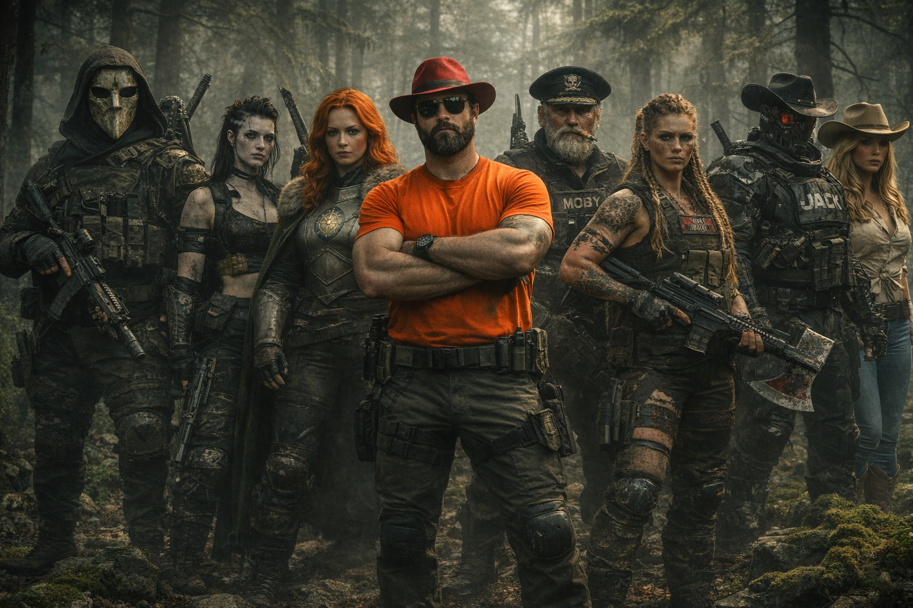
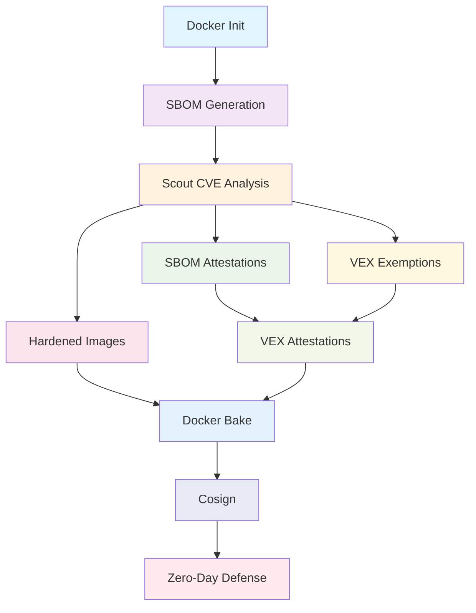

# 🛡 The 10 Docker Commandos: Asgard Mission

Welcome to the **Docker Commandos** workshop. In this mission, you will join an elite team of security specialists to defend Asgard from a shadow monster outbreak known as CVEs.

## Meet your team:

- **Agent Null** 🎭 - The masked hunter
- **Wilhelmina (Mina)** 🧛‍♀️ - The undead assassin
- **Gord** ⚔️ - The swordmaster
- **Rothütle** 🎩 - The tactician
- **Captain Ahab** 🐋 - The veteran commander
- **The Valkyrie** 🛡️ - The identity specialist
- **Jack** 🤖 - The cyborg soldier
- **Evie** 🤠 - The sharpshooter

## Prologue: The Attack on Asgard

Thor enters Odin's chamber hastily, "Father, Asgard is under attack! Shadow monsters called CVEs are in Asgard and my hammer Mjolnir can't destroy them!" Odin looks at him calmly, "**Summon the Docker Commandos**!"

## Command Dependencies

